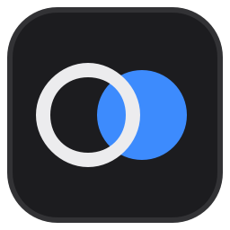
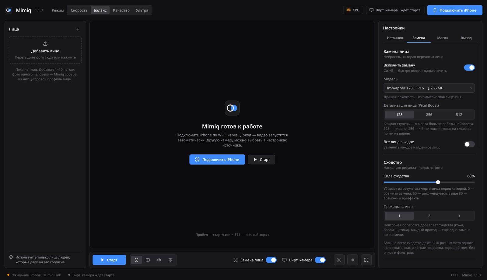
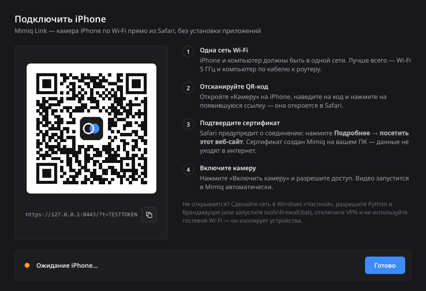
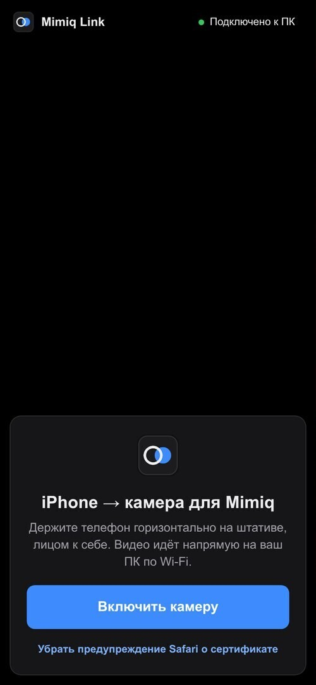

<p align="center">
  
</p>

<h1 align="center">Mimiq</h1>

<p align="center">
  <b>Замена лица в реальном времени для Windows 11.</b><br>
  iPhone — камера по Wi-Fi без приложений, результат — через свою виртуальную камеру «Mimiq Camera» в Zoom, Discord, Telegram, Teams и OBS.
</p>

<p align="center">
  <a href="https://github.com/frostabuz/mimiq/releases/latest"><b>⬇ Скачать для Windows</b></a>
  &nbsp;·&nbsp; <a href="#установка">Установка</a>
  &nbsp;·&nbsp; <a href="#если-что-то-не-так">Если что-то не так</a>
</p>



---

## Что нового в 1.2

- **Своя виртуальная камера «Mimiq Camera».** OBS больше не нужен: камера ставится прямо из Mimiq (вкладка «Вывод» → «Установить») или установщиком, один раз, с разрешением администратора. В Zoom, Teams, Discord, Telegram и браузере выберите **«Mimiq Camera»**. Когда обработка остановлена, камера показывает заставку «Камера на паузе», а не застывшее лицо. OBS Virtual Camera по-прежнему поддерживается.
- **Ускорение NVIDIA TensorRT.** На RTX и GTX 16xx нейросети замены, улучшения, масок и 68 точек собираются под вашу видеокарту — лицо обновляется заметно чаще (обычно в 1,5–3 раза, зависит от видеокарты и пресета). Ставится по желанию (≈1,9 ГБ): установщик спросит сам, либо кнопка «Установить TensorRT» во вкладке «Вывод». Первый запуск — несколько минут на оптимизацию моделей, дальше всё грузится из кэша. Если TensorRT не справится с какой-то моделью, она автоматически работает на CUDA.

## Что нового в 1.1

- **Плавное видео вместо лагов.** Раньше каждый кадр ждал, пока нейросеть закончит замену, — на слабом ПК картинка дёргалась и отставала. Теперь работает **«Плавное видео»**: кадры идут с частотой камеры, а последнее готовое лицо в каждом кадре «приклеивается» к голове по свежим точкам лица. Голова двигается плавно всегда, а мимика обновляется так часто, как успевает ПК.
- **Два потока обработки.** Поиск лица в следующем кадре идёт одновременно с заменой в текущем — скорость определяет самая медленная часть, а не сумма всех.
- **Авто-плавность.** Если ПК не успевает, Mimiq временно отключает самое дорогое и возвращает, когда появляется запас. Ваши настройки не меняются; что сейчас упрощено — написано во вкладке «Вывод».
- **Лёгкий «Баланс».** Пресет по умолчанию больше не включает Pixel Boost 256: он увеличивал работу нейросети замены в 4 раза и почти не влиял на сходство (проверено замерами). Это была главная причина лагов в 1.0.
- **Больше сходства.** Новая настройка **«Сила сходства»**: Mimiq убирает из результата черты человека перед камерой, поэтому лицо меньше похоже на вас и больше — на фото. Плюс «Проходы замены» и индикатор сходства на превью.
- **Спокойный дизайн.** Графитовые цвета без градиентов и свечения, плоские кнопки и вкладки, новая иконка, обновлённая страница Mimiq Link на iPhone.

## Что умеет

- **Замена лица на выбранное фото в реальном времени.** Можно дать 1–10 фото одного человека — Mimiq усреднит их в один профиль, и похожесть станет выше. «Сила сходства» и 1–3 прохода замены — для ещё большего сходства.
- **Плавное видео на любом ПК.** Видео идёт с частотой камеры, даже если нейросеть медленнее; «Авто-плавность» сама подбирает нагрузку под ваш компьютер.
- **Маска не слетает.** Трекер ищет лицо в области, где оно было в прошлом кадре, с учётом наклона головы; точки лица сглаживаются фильтром One Euro (без дрожи в покое и без задержки в движении). При короткой потере лица (смаз, рука, резкий поворот) маска удерживается и плавно гаснет, а не мигает.
- **Предметы перед лицом.** XSeg вырезает руки, микрофон, чашку; BiSeNet точно определяет область лица (вкл. в пресетах «Качество» и «Ультра»).
- **Качество.** InSwapper 128 или HyperSwap 256, Pixel Boost до 512 px, улучшение лица GPEN / GFPGAN / CodeFormer / RestoreFormer++, подгонка цвета под освещение, мягкие края маски, сглаживание маски во времени.
- **iPhone как веб-камера — Mimiq Link.** Отсканировали QR-код — камера открылась в Safari. Фронтальная или основная камера, 720p / 1080p, 30 / 60 к/с, режим «затемнить экран». Шифрование HTTPS, доступ только по секретной ссылке из QR-кода.
- **Своя виртуальная камера «Mimiq Camera»** (OBS не нужен) — её видят Zoom, Teams, Discord, Telegram, Google Meet, Skype, OBS, браузеры. Можно и через «OBS Virtual Camera».
- **Ускорение под видеокарту:** NVIDIA TensorRT / CUDA, DirectML для AMD и Intel.
- **Просмотр:** результат, «до / после» со шторкой, оригинал, маска. Снимки (PNG) и запись видео (MP4).
- **Пресеты** «Скорость», «Баланс», «Качество», «Ультра» + ручная настройка каждого параметра.
- Спокойный тёмный интерфейс на русском, горячие клавиши, полноэкранный режим, водяной знак «AI · Mimiq».


## Что нужно

| | Минимум | Рекомендуется |
|---|---|---|
| Система | Windows 10/11 64-бит | Windows 11 |
| Видеокарта | любая с DirectX 12 (AMD, Intel, NVIDIA) | **NVIDIA RTX 3060 и выше**, драйвер 580+ |
| Python | 3.11–3.13 | 3.12 — установщик поставит сам |
| Диск | 4 ГБ свободно | SSD, 7 ГБ — с TensorRT |
| iPhone | iOS 15+, Safari | iPhone XS и новее, Wi-Fi 5 ГГц |
| Виртуальная камера | своя «Mimiq Camera» (входит в Mimiq) | — |

> На процессоре без видеокарты Mimiq тоже работает: благодаря «Плавному видео» картинка не замирает, но само лицо (мимика) обновляется лишь раз в 1–5 секунд. Для живой мимики нужна видеокарта — см. раздел [«Скорость»](#скорость-если-лагает).

## Установка

1. **Скачайте** `Mimiq-…-windows.zip` со страницы [Releases](https://github.com/frostabuz/mimiq/releases/latest) (раздел Assets) и **распакуйте** его, например в `C:\Mimiq` (не запускайте файлы прямо из архива). Если Windows покажет «Система Windows защитила ваш компьютер», нажмите «Подробнее» → «Выполнить в любом случае».
2. **Обновите драйвер видеокарты.** NVIDIA — через приложение NVIDIA App или с [nvidia.com/drivers](https://www.nvidia.com/Download/index.aspx). С версией 580+ ставится новейшая сборка CUDA 13.
3. **Запустите `install.bat`** (двойной щелчок). Он сам:
   - найдёт Python 3.12, а если его нет — предложит установить через winget;
   - создаст окружение `.venv` внутри папки (в систему ничего не ставится);
   - установит библиотеки;
   - **выберет ускорение под вашу видеокарту** и проверит, что оно реально работает:

     | Видеокарта | Что ставится |
     |---|---|
     | NVIDIA RTX 20/30/40/50, GTX 16xx + драйвер 580+ | `onnxruntime-gpu` — CUDA 13 + cuDNN |
     | NVIDIA GTX 9xx/10xx или драйвер ниже 580 | `onnxruntime-gpu 1.26` — CUDA 12 + cuDNN |
     | AMD Radeon, Intel Arc / Iris Xe | `onnxruntime-directml` — DirectX 12 |
     | без видеокарты | `onnxruntime` — процессор |

   - на NVIDIA RTX / GTX 16xx **предложит TensorRT** (≈1,9 ГБ) — с ним лицо обновляется заметно чаще; можно отказаться и добавить позже командой `install.bat tensorrt`;
   - скачает нейросети (~680 МБ, с докачкой при обрыве);
   - **установит виртуальную камеру «Mimiq Camera»** — Windows один раз спросит разрешение администратора (камера регистрируется в системе, файлы кладутся в `C:\Program Files\Mimiq Camera`);
   - создаст ярлык **Mimiq** на рабочем столе и в «Пуске».

Повторный запуск `install.bat` ничего не ломает — он обновит и починит установку.
Выбрать ускорение вручную: `install.bat cuda`, `install.bat cuda12`, `install.bat directml` или `install.bat cpu`. Только добавить TensorRT: `install.bat tensorrt`. Пропустить шаги: `--no-tensorrt`, `--no-camera`, `--no-models`.

## Первый запуск

1. Откройте **Mimiq** (ярлык или `Mimiq.bat`) и прочитайте правила использования.
2. **Добавьте лицо:** «+» слева или перетащите фото в окно. Лучше 3–10 чётких фото одного человека: анфас и лёгкие повороты, хороший свет, без очков от солнца и рук у лица. Подходят JPG, PNG, WEBP и HEIC с iPhone.
3. Нажмите **«Подключить iPhone»** и отсканируйте QR-код камерой iPhone.
4. В Safari появится предупреждение о сертификате: **«Подробнее» → «посетить этот веб-сайт»**. Сертификат создан Mimiq на вашем ПК, видео не уходит в интернет.
5. Нажмите **«Включить камеру»** → «Разрешить». Mimiq сам начнёт обработку, как только придёт видео.
6. В Zoom / Discord / Telegram / Teams выберите камеру **«Mimiq Camera»**. Если при установке вы её пропустили — «Вывод» → «Виртуальная камера» → **«Установить»**.

| Окно подключения | Mimiq Link на iPhone |
|---|---|
|  |  |

## iPhone: советы для стабильной картинки

- iPhone и ПК — **в одной сети**. Лучше всего Wi-Fi 5 ГГц на телефоне и кабель от ПК к роутеру.
- В Windows сеть должна быть **«Частной»**: Параметры → Сеть и Интернет → Wi-Fi (или Ethernet) → ваша сеть → Тип сетевого профиля → **Частная**.
- При первом запуске Windows спросит про брандмауэр для Python — **разрешите доступ в частных сетях**. Если окно закрыли — запустите `tools\firewall.bat`.
- Отключите VPN на ПК и iPhone. Гостевая сеть роутера изолирует устройства — используйте основную.
- Safari должен оставаться на экране: iOS ставит камеру на паузу, если свернуть браузер. Кнопка 🌙 затемняет экран, чтобы телефон меньше грелся и тратил батарею. Mimiq Link не даёт экрану гаснуть, но на время эфира лучше поставить iPhone на зарядку.
- Чтобы закрепить телефон, подойдёт любой штатив или держатель на монитор. Камера — на уровне глаз.

### Убрать предупреждение о сертификате (необязательно)

На странице Mimiq Link внизу откройте «Убрать предупреждение Safari о сертификате»:

1. Скачайте сертификат Mimiq → «Разрешить».
2. Настройки → Основные → VPN и управление устройством → «Mimiq Local CA» → Установить.
3. Настройки → Основные → Об этом устройстве → Доверие сертификатам → включите «Mimiq Local CA».

Сертификат уникален для вашего ПК, а его ключ не покидает компьютер. Он ограничен адресами локальной сети (X.509 Name Constraints) и не может подтверждать другие сайты. Удалить: Настройки → Основные → VPN и управление устройством.

### Другие способы подключить iPhone

Mimiq работает с любой камерой, которую видит Windows. Если удобнее USB:
**Camo**, **iVCam**, **Iriun Webcam** — установите их приложение на iPhone и ПК и выберите в Mimiq: Источник → **Камера** → нужное устройство.
Поток по ссылке (Источник → **Поток**): например DroidCam — `http://IP-телефона:4747/video`, любая MJPEG/RTSP-камера.

## Пресеты

| Пресет | Замена | Улучшение лица | Маска и трекинг | Для чего |
|---|---|---|---|---|
| **Скорость** | InSwapper 128 | — | XSeg | слабые видеокарты и ноутбуки |
| **Баланс** | InSwapper 128 | GPEN 256 (70%) | XSeg + 68 точек | **по умолчанию**, звонки и стримы |
| **Качество** | InSwapper 128 + Pixel Boost 256 | GPEN 512 | XSeg + BiSeNet + 68 точек | RTX 3070 / 4060 Ti и выше |
| **Ультра** | InSwapper 128 + Pixel Boost 256, 2 прохода | GPEN 512 | XSeg + BiSeNet + 68 точек | RTX 4080 / 4090, запись видео |

Недостающие модели для пресета скачиваются автоматически при его выборе. В левом верхнем углу превью видна частота видео, а если ПК не успевает — ещё и как часто обновляется лицо («лицо 12/с»). С включённой «Авто-плавностью» Mimiq сам снизит нагрузку, если пресет тяжеловат для вашего ПК.

### Как получить лучший результат

- **Больше похожести:** см. раздел [«Больше сходства»](#больше-сходства) ниже.
- **Маска дрожит:** увеличьте «Сглаживание движения» (вкладка «Замена» → «Отслеживание») и «Стабильность маски» (вкладка «Маска»). Дайте лицу больше света — в полумраке точность падает.
- **Маска пропадает при поворотах:** увеличьте «Удержание при потере лица», уменьшите «Порог уверенности», включите «Уточнение по 68 точкам» (вкладка «Замена» → «Отслеживание»).
- **Видны края или кожа как пластик:** увеличьте «Растушёвку краёв» (вкладка «Маска»), уменьшите «Силу улучшения» до 60–80% и подстройте «Подгонку тона кожи» (вкладка «Замена»).
- **Рука, очки или микрофон перед лицом:** включите «Не перекрывать предметы» (вкладка «Маска», включено во всех пресетах).
- **Камера:** на уровне глаз, свет спереди, лицо занимает хотя бы треть кадра. Повороты больше ~60° любая модель передаёт хуже.

### Больше сходства

- **3–10 фото одного человека** — самый сильный способ. Анфас и лёгкие повороты (до ~30°), ровный свет, разные дни и выражения лица; без солнцезащитных очков, фильтров и рук у лица. Mimiq усредняет все фото в один профиль. Добавить фото к готовому лицу: «⋯» на карточке → «Добавить фото…».
- **«Сила сходства»** (вкладка «Замена» → «Сходство»). 60% — рекомендуется; 70–80% — ещё ближе к фото, но иногда появляются артефакты у глаз и губ; 0% — обычная замена, как в версии 1.0.
- **«Проходы замены» = 2** — ещё немного сходства (брови, щетина, кожа), но вдвое больше работы для нейросети. Включено в пресете «Ультра».
- **Индикатор сходства** внизу превью («сходство высокое») и точное число в строке состояния — это сравнение результата с профилем лица нейросетью ArcFace: 0.6+ — хорошо, 0.7+ — отлично.
- **«Сила улучшения»** держите на 60–75%: при 90–100% улучшение лица немного «усредняет» черты.
- **Что не меняется:** нейросеть переносит черты лица — глаза, брови, нос, рот, кожу. Форма головы, причёска, уши и овал остаются от человека в кадре — чем ближе они к человеку на фото, тем сильнее эффект.
- Pixel Boost на сходство почти не влияет — он про чёткость. У модели HyperSwap сходство в наших замерах ниже, чем у InSwapper (0,65 против 0,72).

## Скорость: если лагает

Каждый кадр проходит через несколько нейросетей. На видеокарте NVIDIA RTX это 10–30 мс, на процессоре — секунды.

1. **Посмотрите на значок в шапке.** «TensorRT», «CUDA» или «DirectML» — нейросети считает видеокарта. «CPU» — процессор, это в десятки раз медленнее (см. [«Если что-то не так»](#если-что-то-не-так) → «В шапке CPU»).
2. **NVIDIA RTX? Включите TensorRT.** «Вывод» → «Производительность» → «Установить TensorRT» (или `install.bat tensorrt`), затем перезапустите Mimiq — «Авто» сам выберет «NVIDIA TensorRT». Лицо обновляется обычно в 1,5–3 раза чаще. Первый запуск и первый запуск после смены модели — пара минут на оптимизацию (на превью написано, что происходит), дальше модели грузятся из кэша за секунды.
3. **«Плавное видео»** (вкладка «Вывод» → «Производительность», включено по умолчанию): видео идёт с частотой камеры, а лицо обновляется так часто, как успевает ПК. Выключать его стоит, только если вам важнее, чтобы мимика в каждом кадре была точной, а не плавность.
4. **«Авто-плавность»** (там же, включено): если ПК не успевает, Mimiq по очереди отключает 2-й проход, Pixel Boost, улучшение лица, точную форму маски и 68 точек — только то, что реально заметно ускорит, — и возвращает их, когда появляется запас.
5. **Пресет ниже.** «Скорость» — без улучшения лица и 68 точек, примерно на четверть легче «Баланса»; «Качество» и «Ультра» тяжелее «Баланса» в 3–6 раз из-за Pixel Boost, GPEN 512 и проходов.
6. **Pixel Boost — самая дорогая настройка.** 256 — в 4 раза больше работы для нейросети замены, 512 — в 16 раз. На сходство почти не влияет, только на чёткость кожи и глаз.
7. **Камера 720p и 30 к/с** вместо 1080p и 60 к/с — меньше нагрузка на Wi-Fi и поиск лица.
8. **Только процессор?** Модель HyperSwap 1A 256 (вкладка «Замена» → «Модель») на процессоре примерно в 3 раза быстрее InSwapper — лицо будет обновляться чаще, но сходство ниже.
9. Ноутбук — на зарядке и в режиме «Высокая производительность». Закройте игры и программы, которые нагружают видеокарту.

Сколько стоит каждая часть по сравнению с самой заменой (замер на процессоре; на видеокарте все части в десятки раз быстрее, а пропорции похожи):

| Часть | Работа |
|---|---|
| Замена InSwapper, Pixel Boost 128 | 1× |
| … Pixel Boost 256 / 512 | 4× / 16× |
| 2 / 3 прохода замены | 2× / 3× |
| Улучшение лица GPEN 256 | ~0,2× |
| 68 точек (2DFAN4) | ~0,17× |
| Маска перекрытий (XSeg) | ~0,15× |
| Точная форма маски (BiSeNet) | ~0,1× |
| Поиск лица (RetinaFace) | ~0,03× |

## Горячие клавиши

| Клавиши | Действие |
|---|---|
| `Пробел` | Старт / Стоп |
| `Ctrl+E` | Замена лица вкл/выкл |
| `Ctrl+1` … `Ctrl+4` | Результат / Сравнение / Оригинал / Маска |
| `Ctrl+S` | Снимок |
| `Ctrl+R` | Запись видео |
| `F11` | Полный экран |
| `Ctrl+H` | Скрыть подписи на превью |
| `Esc` | Выйти из полного экрана |

## Где лежат файлы

| Что | Где |
|---|---|
| Программа, окружение `.venv`, нейросети `models` | папка Mimiq |
| Лица, настройки, сертификаты, журнал, кэш TensorRT | `%LOCALAPPDATA%\Mimiq` |
| Виртуальная камера «Mimiq Camera» | `C:\Program Files\Mimiq Camera` |
| Снимки | `Изображения\Mimiq` |
| Видео | `Видео\Mimiq` |

**Удаление:** сначала удалите камеру — «Вывод» → «Виртуальная камера» → **«Удалить»** (или `tools\camera-uninstall.bat`), затем папку Mimiq, папку `%LOCALAPPDATA%\Mimiq` и ярлыки. На iPhone — профиль «Mimiq Local CA», если устанавливали.

## Если что-то не так

<details>
<summary><b>В шапке «CPU», всё очень медленно</b></summary>

- NVIDIA: обновите драйвер и запустите `install.bat` ещё раз — он проверит CUDA и при проблеме предложит запасной вариант.
- GTX 9xx/10xx: `install.bat cuda12`. Если и так не работает — `install.bat directml`.
- AMD/Intel: `install.bat directml`.
- Ноутбук: подключите зарядку и в Параметры → Система → Дисплей → Графика назначьте Python «Высокая производительность».

</details>

<details>
<summary><b>Видео плавное, но мимика запаздывает или лицо «замирает»</b></summary>

Так выглядит «Плавное видео» на ПК, который не успевает обновлять лицо в каждом кадре: голова двигается с частотой камеры, а выражение лица обновляется реже (на превью — «лицо N/с»). Что сделать — в разделе [«Скорость»](#скорость-если-лагает). Чаще всего помогает видеокарта вместо процессора и пресет «Скорость».

</details>

<details>
<summary><b>iPhone не открывает страницу по QR-коду</b></summary>

- Проверьте, что iPhone и ПК в одной сети, а сеть в Windows — «Частная».
- Запустите `tools\firewall.bat` (попросит права администратора).
- Отключите VPN, не используйте гостевую сеть.
- Если у ПК несколько адресов (VPN, виртуальные машины) — выберите другой IP в окне подключения.
- Порт 8443 занят — Mimiq сам возьмёт следующий свободный, QR-код обновится.

</details>

<details>
<summary><b>Safari: «Нет доступа к камере»</b></summary>

- Настройки → Safari → Камера (в iOS 18: Настройки → Приложения → Safari → Камера) → «Спросить» или «Разрешить», затем обновите страницу.
- Закройте другие приложения, которые используют камеру (FaceTime, Telegram).

</details>

<details>
<summary><b>Zoom / Discord не видит «Mimiq Camera»</b></summary>

- «Вывод» → «Виртуальная камера»: там должно быть написано «Установлена». Если нет — нажмите «Установить» и разрешите запрос Windows.
- В Mimiq должен быть включён переключатель «Вирт. камера», а значок в шапке — зелёным.
- Камера видна приложениям, которые работают с обычными веб-камерами Windows (DirectShow): Zoom, Teams, Discord, Telegram, Skype, OBS, Chrome, Edge, Firefox. Встроенное приложение «Камера» Windows виртуальные камеры такого типа не показывает.
- Если приложение показывает цветной узор с надписью «Unity has not started sending image data» — Mimiq ещё не начал трансляцию: нажмите «Старт».
- Хотите по-старому через OBS — выберите «Драйвер» → «OBS Virtual Camera» (нужен OBS Studio 28+, один раз запустить и остановить в нём виртуальную камеру).
- Перезапустите Zoom/Discord после запуска Mimiq — некоторые программы ищут камеры только при старте.
- В браузере закройте и откройте вкладку с видеозвонком.

</details>

<details>
<summary><b>TensorRT: долгая «оптимизация», ошибка или не появляется в списке</b></summary>

- Оптимизация (несколько минут) бывает только при первом запуске и после смены модели или видеокарты/драйвера — потом всё берётся из кэша. Не закрывайте Mimiq в это время.
- «NVIDIA TensorRT — не установлено» в «Вычисления»: запустите `install.bat tensorrt` и перезапустите Mimiq.
- Нужна NVIDIA RTX 20/30/40/50 или GTX 16xx. На GTX 9xx/10xx TensorRT не работает — остаётся CUDA.
- Если TensorRT не справился с какой-то моделью, Mimiq сам переключит её на CUDA и покажет уведомление. Вернуться на CUDA полностью: «Вычисления» → «NVIDIA CUDA».
- Кэш TensorRT лежит в `%LOCALAPPDATA%\Mimiq\cache\tensorrt` — его можно удалить, Mimiq пересоберёт модели.

</details>

<details>
<summary><b>Не скачиваются нейросети</b></summary>

Модели скачиваются с Hugging Face (запасной адрес — GitHub). Если они заблокированы у вашего провайдера, включите VPN только на время загрузки и выполните:

```
.venv\Scripts\python tools\download_models.py
```

Список моделей и их состояние: `tools\download_models.py --list`. Все модели сразу: `--all`.

</details>

<details>
<summary><b>Программа не запускается или закрывается</b></summary>

- Запустите `tools\Mimiq-debug.bat` — ошибки будут видны в окне.
- Журнал: `%LOCALAPPDATA%\Mimiq\logs\mimiq.log`.
- Ошибка `DLL load failed` — установите [Microsoft Visual C++ Redistributable](https://aka.ms/vs/17/release/vc_redist.x64.exe).
- Удалите папку `.venv` и запустите `install.bat` заново.

</details>

## Как это устроено

```
iPhone (Safari, getUserMedia)
   └─ JPEG-кадры по WebSocket/HTTPS ─▶ Mimiq Link (aiohttp, TLS)
                                          │
Камера ПК / поток ───────────────────────▶┤
                                          ▼
 Поток A · каждый кадр      поиск лица (RetinaFace в области + 68 точек 2DFAN4 + One Euro)
                            → выравнивание → «приклеивание» последнего готового лица
                                          │ задание, когда поток B свободен
                                          ▼
 Поток B · сколько успевает XSeg → ArcFace-условие (сила сходства) → InSwapper / HyperSwap
                            (Pixel Boost, 1–3 прохода) → маска (форма + XSeg + BiSeNet,
                            сглаживание) → подгонка цвета → улучшение (GPEN / GFPGAN /
                            CodeFormer) → кадр + кэш лица
                                          │
                ┌─────────────────────────┼──────────────────────┐
                ▼                         ▼                      ▼
        превью в Mimiq            Mimiq Camera            снимки и видео
```

- Если поток B успевает за камерой, кадры выходят прямо из него — каждый кадр с точной мимикой.
- Если нет — включается «плавное видео»: каждый кадр собирает поток A из свежего кадра камеры и последнего готового лица. Лицо хранится «до смешивания» в координатах лица, поэтому накладывается по текущим точкам без швов, а движения головы идут с частотой камеры.
- «Сила сходства»: условие для нейросети замены — это профиль лица с фото, от которого отодвинут профиль человека в кадре (ArcFace, обновляется раз в секунду).
- С TensorRT нейросети замены, улучшения, масок и 68 точек работают как движки TensorRT, собранные под вашу видеокарту (кэш в `%LOCALAPPDATA%\Mimiq\cache\tensorrt`); поиск лица с меняющимся размером входа остаётся на CUDA.
- «Авто-плавность» следит за временем обоих потоков и отключает только те дополнения, которые реально ускорят нужный поток.

```
Mimiq/
├─ install.bat            установка и починка
├─ Mimiq.bat              запуск
├─ requirements.txt
├─ tools/                 установщик, выбор ONNX Runtime, загрузчик моделей, брандмауэр, отладка
├─ docs/                  скриншоты
└─ mimiq/
   ├─ app.py, engine.py   запуск, потоки захвата → обработки → вывода
   ├─ core/               модели, детекция, трекер, фильтры, замена, маски, профили лиц, авто-плавность
   ├─ io/                 Mimiq Link, сертификаты, камеры и потоки, виртуальная камера
   ├─ vcam/               драйвер камеры «Mimiq Camera» (Unity Capture, MIT)
   ├─ ui/                 интерфейс (PySide6)
   └─ web/                страница Mimiq Link для iPhone
```

## Обновление

Скачайте новый архив со страницы [Releases](https://github.com/frostabuz/mimiq/releases/latest) и распакуйте поверх старой папки Mimiq — окружение `.venv` и нейросети `models` сохранятся, лица и настройки лежат отдельно. Затем запустите `install.bat`, чтобы обновить библиотеки (в 1.2 он заодно предложит TensorRT и камеру «Mimiq Camera»).

<details>
<summary><b>Для разработчика: как выпустить новую версию</b></summary>

1. Поменяйте `__version__` в `mimiq/__init__.py` и текст в `.github/release-notes.md`.
2. Закоммитьте и создайте тег с тем же номером:
   ```
   git tag v1.2.0
   git push origin main v1.2.0
   ```
3. GitHub Actions соберёт `Mimiq-1.2.0-windows.zip` и опубликует релиз (вкладка Actions → Release).

</details>

## Ответственное использование

Mimiq создан для развлечения, творчества, стримов и личных экспериментов.

- Используйте **только своё лицо или лица людей, которые дали на это явное согласие**.
- Не выдавайте себя за другого человека, не используйте Mimiq для обмана, мошенничества, травли, интимного контента и дезинформации.
- Предупреждайте собеседников, что видео изменено. Водяной знак «AI · Mimiq» включён по умолчанию (вкладка «Вывод»).
- Изображение человека охраняется законом (например, ст. 152.1 ГК РФ). Ответственность за использование несёт пользователь.

## Лицензии

Нейросети — сторонние, скачиваются из открытого репозитория FaceFusion на Hugging Face и распространяются по своим лицензиям. Модели InsightFace (InSwapper, ArcFace, RetinaFace), CodeFormer и ряд других разрешены **только для некоммерческого использования**. Mimiq предназначен для личного некоммерческого применения.

Используемые библиотеки: PySide6 (LGPL), ONNX Runtime (MIT), OpenCV (Apache 2.0), NumPy (BSD), aiohttp (Apache 2.0), cryptography (Apache 2.0 / BSD), pyvirtualcam (GPL-2.0), qrcode (BSD), Pillow (MIT-CMU), pillow-heif (BSD). NVIDIA TensorRT (лицензия NVIDIA, ставится по желанию из pypi.nvidia.com).

Виртуальная камера «Mimiq Camera» — это фильтр DirectShow [Unity Capture](https://github.com/schellingb/UnityCapture) © 2018 Bernhard Schelling, лицензия MIT (неизменённые файлы и текст лицензии — в `mimiq/vcam`).
